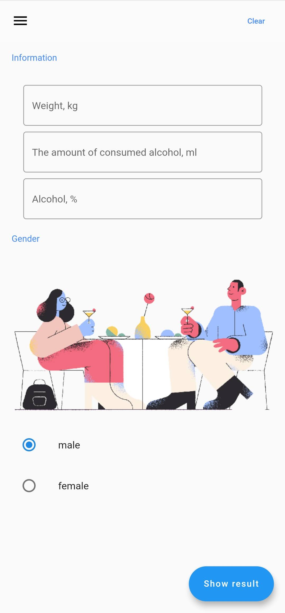
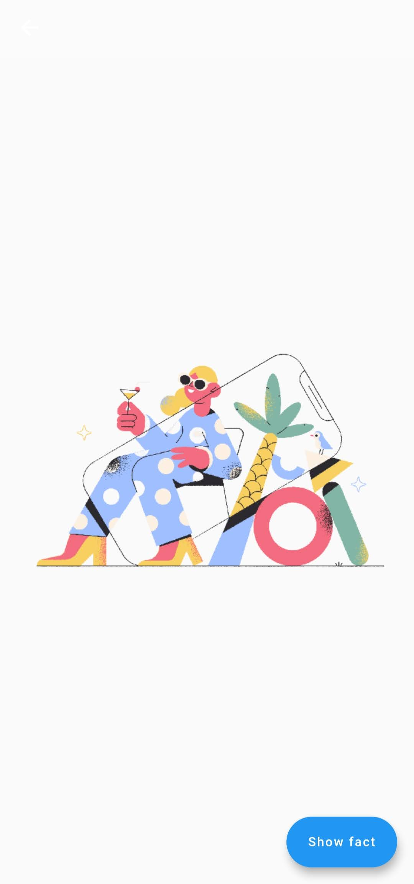

# alco

# Rang

Application created with UI framework caled Flutter.

It's a simple app with flawless animations.

 

# Application features:

 1. App has two pages: Home page and About page.
- Home page:
       You have min and max fields. Enter your min and max numbers and press 'Generate' to generate random number. Press 'Clear' to clear all the fields.
- About page:
       It's information page with some interactivity. You can call, share and navigate from this screen. You can press star to add/remove it's favorite status.
- Favorite page:
       It's a list (technicaly It is a sliverlist) of favorites numbers with descriptions.
       
  
  

Application is in development stage.
