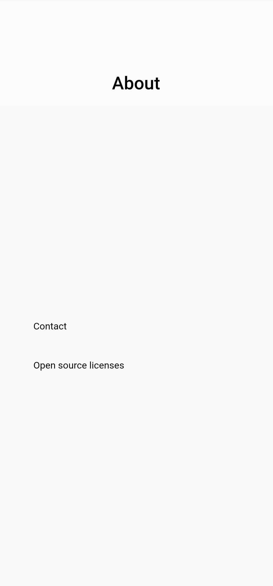
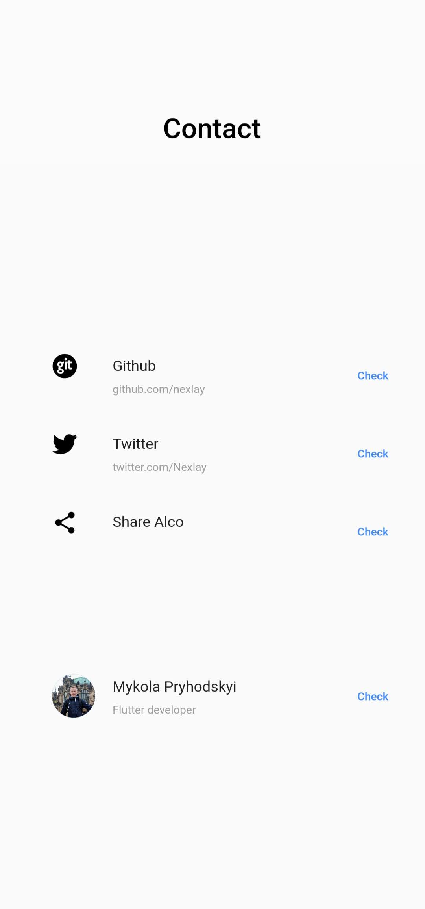

# alco

Application created with UI framework caled Flutter.

It's a simple app with flawless animations.

 

# Application features:

- Home page:
       Enter your weight, consumed amount and alcohol in %. To calculate amount of alcohol in blood press 'Show result'.
- Facts about alcohol:
       Some interesting facts about alcohol.

       
  
  

Application is in development stage.
